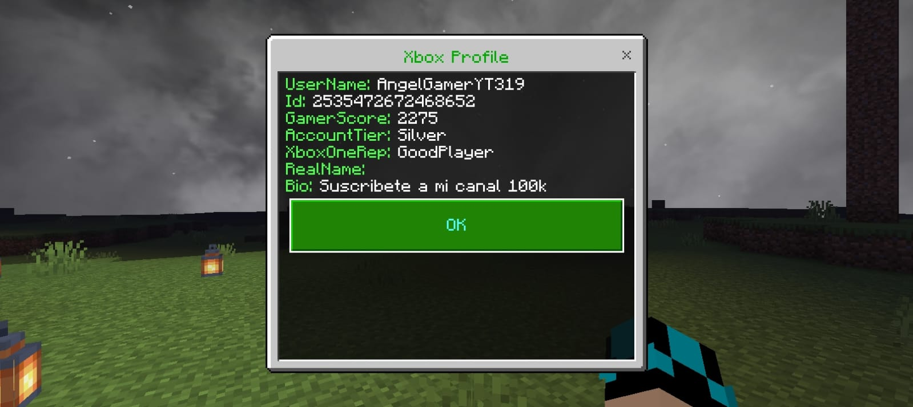

<h1></img>Xbox</h1> 

</img>
 

The Xbox plugin for PocketMine-MP allows players to view Xbox profiles directly in-game. By using a simple command, players can retrieve detailed information about a specified Xbox gamertag, including username, gamer score, account tier, and more. This plugin is designed to enhance the gaming experience by providing quick and easy access to Xbox profile data.

 

<table border="1">
  <tr>
    <th>Description</th>
    <th>Link</th>
  </tr>
  <tr>
    <td>API</td>
    <td></td>
  </tr>
  <tr>
    <td>Version</td>
    <td></td>
  </tr>
  <tr>
    <td>Downloads</td>
    <td></td>
  </tr>
</table>

## Facility

Download the latest release from Poggit.
Place the downloaded file in the plugins directory of your PocketMine-MP server.
Restart your server.

## Use

To use this plugin, simply execute the /xboxprofile <gamertag> command in the game chat. This will display the Xbox profile information of the specified gamertag in a simple form.
<h3>Commands</h3>
/xboxprofile <player>: View the Xbox profile of the specified player.
<h3>Permissions</h3>
xboxprofile.command: Allows the use of the /xboxprofile command.
  
## Screenshots

<h3>🌐 Web Sites:</h3>

- [ Pocket Mine School](https://pocketmineschool.netlify.app/)
- [ MCPETools](https://mcpetools.surge.sh/)

<h3>Connect with me:</h3>

- 

- 

<h3>💰 You can help me by Donating</h3>

